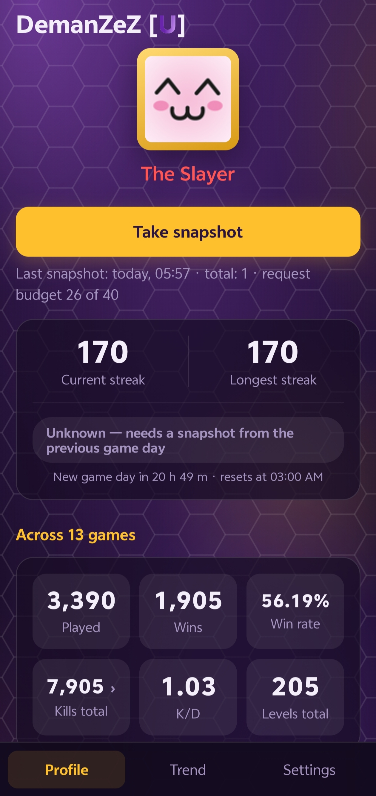
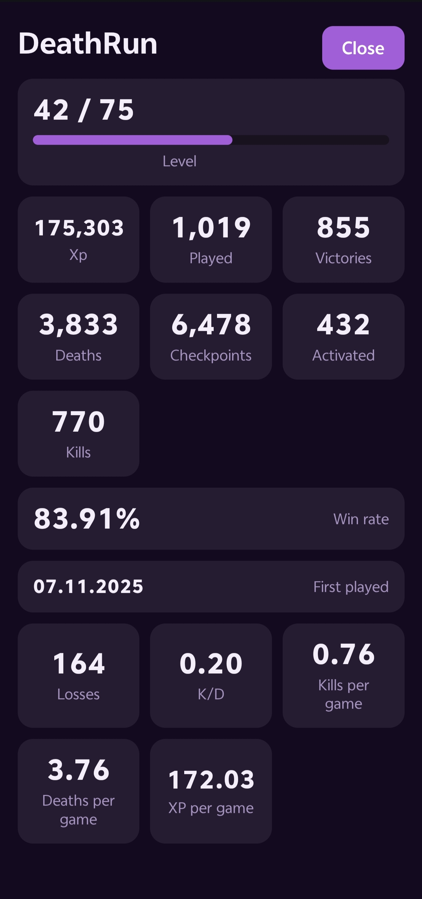
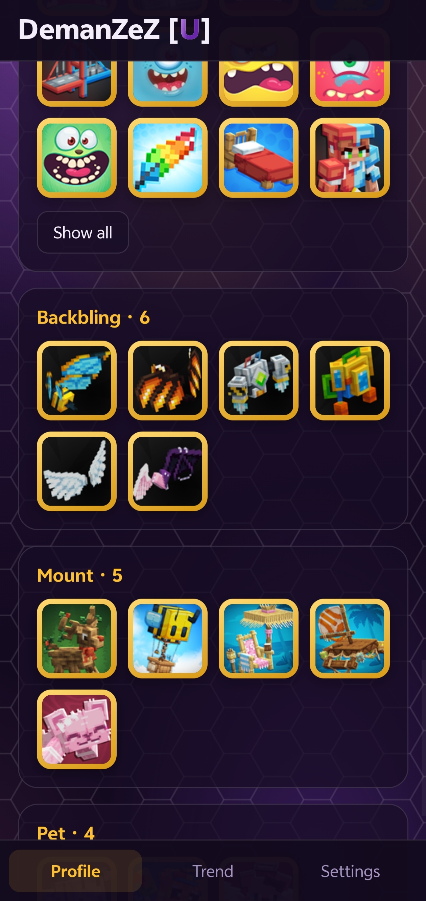
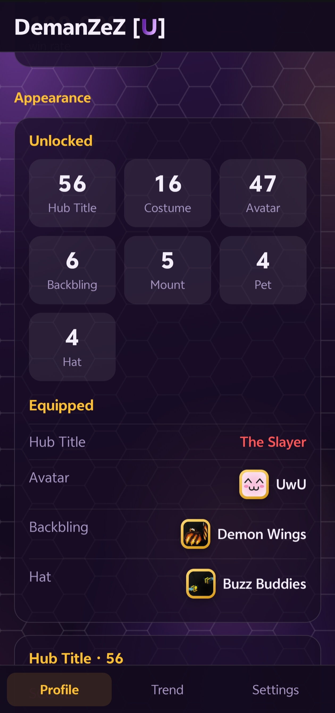
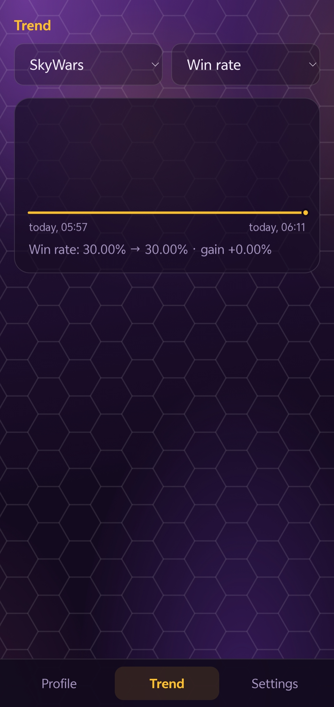
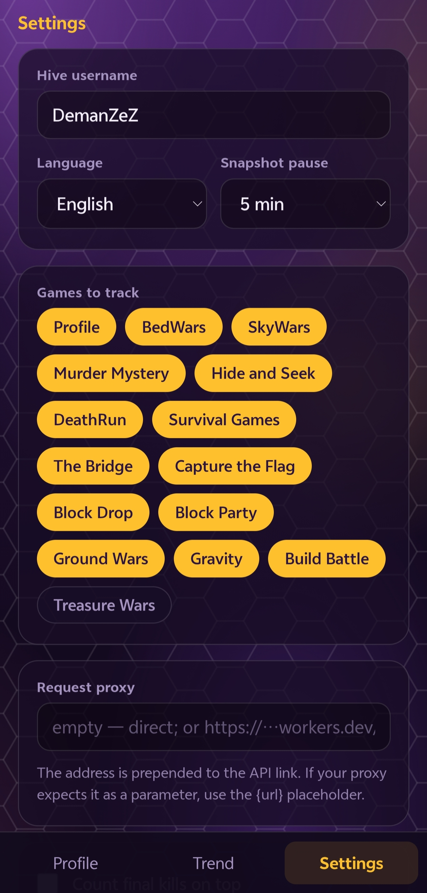
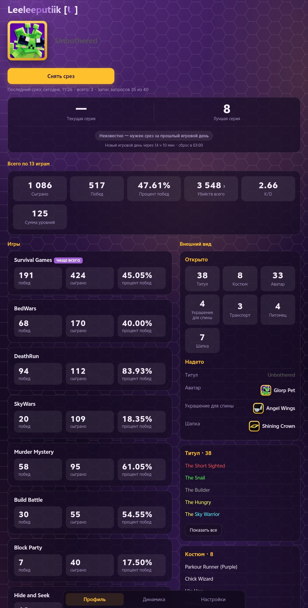

# HiveMC Profile Tracker

A stats tracker for [The Hive](https://playhive.com), the Minecraft Bedrock server. One HTML file — no build step, no dependencies, no backend. Open it and it works.

**Live:** https://deman-zez.github.io/HiveMC-Profile-Tracker/

> [!NOTE]
> **Open Beta:** The project is currently in open beta and under active development. If you encounter any bugs or have suggestions, please [open an issue](https://github.com/deman-zez/HiveMC-Profile-Tracker/issues)!

Your Hive profile already shows where you stand today. This shows where you are *going*: it saves snapshots of your stats over time and turns them into progress you can actually see.

## What's new

- **One request per snapshot.** The whole profile — main stats and every game — now comes from a single call to `/game/all/all/{player}` instead of one call per game. Snapshots are several times faster.
- **No limits.** The app no longer caps requests or usernames per hour, and there is no pause between snapshots. The buttons only ignore repeated taps within five seconds, so a double tap doesn't fire twice.
- **Live counters in titles.** Titles like `Total Kills` or `Winrate` now show the real number (`11.5K Total Kills`) instead of an empty placeholder.
- **Title icons.** Prestige badges, beds, swords and other icons inside titles are shown as the same artwork the game uses.
- **Trend by time, with a range picker.** The chart is spaced by real time, so frequent snapshots no longer flatten it into a straight line, and you can zoom to 24 hours, 7 days, 30 days or all time.
- **All games tracked by default**, except the discontinued Treasure Wars. Games you have never played are hidden from the profile.
- **Proper Russian grammar** in counts — 1 победа, 2 победы, 5 побед.
- **Cleaner game details.** Build Battle ratings are listed from best to worst, and K/D only appears in games that actually have kills.
- **Smoother desktop.** Mouse-wheel scrolling glides instead of jumping, and the Profile tab remembers where you scrolled.
- **Proxy removed.** Direct requests to the Hive API work without CORS problems, so the proxy field is gone.

## Screenshots

| Profile | Game breakdown | Cosmetics |
|---|---|---|
|  |  |  |

| Appearance | Trend | Settings |
|---|---|---|
|  |  |  |

## Features

**Profile at a glance.** Rank tag next to your name, equipped avatar, and the hub title rendered with its real in-game colours, icons and live counters. The shimmer plays through darker and lighter shades of each coloured segment and runs across the whole title as one wave, so even a title where every letter has its own colour, like `SkyWars`, keeps every colour. A login streak card tells you whether today's login has already counted, with a countdown to the next game day in your own timezone.

**Player search.** Start typing a username and matching players appear below the field, with the part you typed highlighted. Pick one and the whole profile switches to them — handy for scouting an opponent.

**Every game, every field.** Cards are sorted by how much you play them, with the most played one marked. Tap any card for the full picture: level progress, win rate, K/D, kills and deaths per game, XP per game, and every raw field the API returned. Nothing is hardcoded, so new fields show up on their own.

**Cosmetics.** Hub titles, avatars, costumes, hats, backblings, mounts and pets — what you own and what you have equipped, newest first, with icons pulled straight from Hive's CDN.

**Snapshots and trends.** Every refresh stores a snapshot locally. Once you have two, the Trend tab plots any metric over a time range you choose — including computed ones like win rate and K/D, which the API does not return.

**Kill breakdown.** Total kills are assembled from different fields across games (`kills`, `hider_kills`, `murders` and so on). Tap the tile to see exactly which fields were counted per game, with totals both with and without final kills, so you can match the number to your in-game Total Kills title.

**Multiple accounts.** Snapshots are tied to the username they were taken for, so you can track yourself and a few friends without their history bleeding into yours.

**Bilingual.** English and Russian, picked from your device language, switchable in settings.

## Desktop mode

The layout is not just a stretched phone screen. On screens 900px and wider it switches to a dedicated desktop mode:



- Two columns: games on the left, the cosmetics locker on the right.
- The header becomes horizontal — avatar beside the name and title instead of stacked.
- Each game gets a full-width row with wins, games played and win rate side by side.
- Detail views open as centred dialogs with their own scrolling; the page behind them stays put.
- The tab bar turns into a floating centred pill, and cards, chips and buttons respond to hover.

Everything stays in the same single file — there is no separate desktop build.

## Getting started

1. Open the page and go to **Settings**.
2. Enter your Hive username, or start typing and pick it from the suggestions.
3. Untick any games you don't care about — everything except Treasure Wars is on by default.
4. Go back and press **Take snapshot**.

The first snapshot gives you your current stats. The second one and everything after builds history, and the Trend tab comes alive.

All data lives in your browser's `localStorage`. Nothing is uploaded anywhere, and there is no account to create. Settings include backup export and import if you want to move between devices.

## Fair use

The app has no request limits of its own. A snapshot costs a single request no matter how many games you track, and buttons simply ignore repeat taps within five seconds.

Hive's public API still has its own rate limit. If you hit it, the app shows the error and you just try again a bit later.

**Please do not use this to bulk-query other people's accounts.** The public API is a courtesy from Hive, and it stays available only while people treat it well.

## Running locally

Opening the file directly from disk usually works, but browsers often block storage on `file://` and `content://` origins, which means your snapshots will not persist. Serve it over HTTP instead:

```bash
python3 -m http.server 8080
```

Then open `http://localhost:8080`.

## How it is built

Plain HTML, CSS and vanilla JS in a single ~113 KB file. No frameworks, no bundler, no build step.

- Stats come from the public API at `api.playhive.com/v0`: one request to `/game/all/all/{player}` per snapshot, plus `/player/search` for the username suggestions.
- Requests send `X-Hive-Resolve-Stat-Track: true`, so Hive fills in the numbers in dynamic titles before returning them.
- Title icons are glyphs from Hive's own image set; the file number is the character's code point minus `0xE100`.
- Levels are derived from XP using [hive-bedrock-data](https://github.com/CubeEdge-Studios/hive-bedrock), loaded from a CDN at runtime, with a built-in table as a fallback.
- Cosmetic icons come from `cdn.playhive.com`. Players without a known avatar get a coloured tile derived from their UUID, so the same person always looks the same.
- The gradient background, the drifting light, the scroll-linked dimming and every transition run on compositor-only properties so they never interfere with scrolling. A **Fewer animations** switch in settings turns them off entirely, and the system "reduce motion" preference is respected automatically.
- Charts are hand-drawn SVG — no charting library.
- Visitor counts use [Cloudflare Web Analytics](https://www.cloudflare.com/web-analytics/), which sets no cookies and tracks nobody across sites.

## Credits

- [The Hive](https://playhive.com) for the server and the public API.
- [hive-bedrock-data](https://github.com/CubeEdge-Studios/hive-bedrock) by CubeEdge Studios for the level curves and game metadata.

This project is unofficial and not affiliated with or endorsed by The Hive. All game names, cosmetic names and images belong to their respective owners.

## License

MIT — see [LICENSE](LICENSE).
