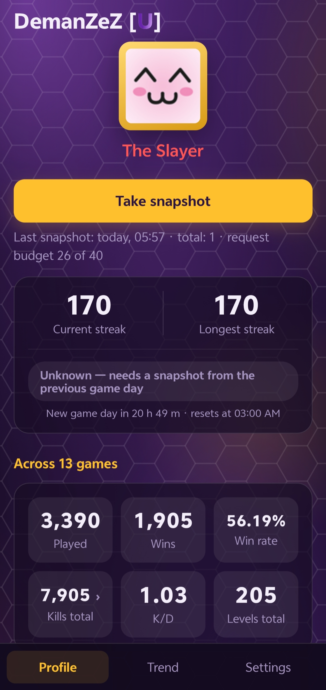
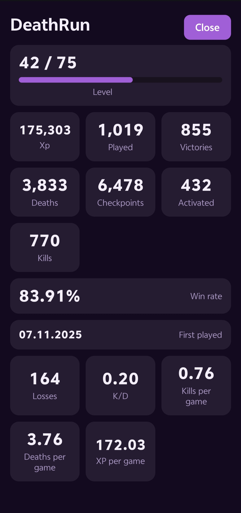
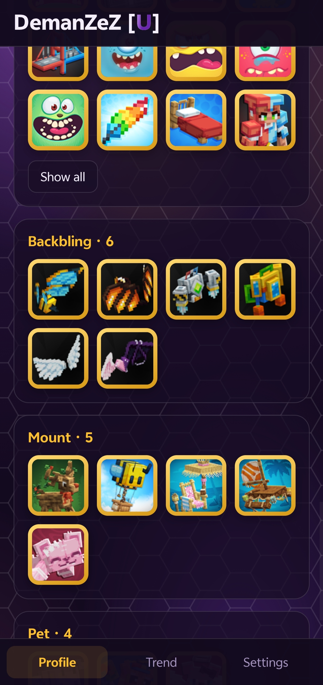
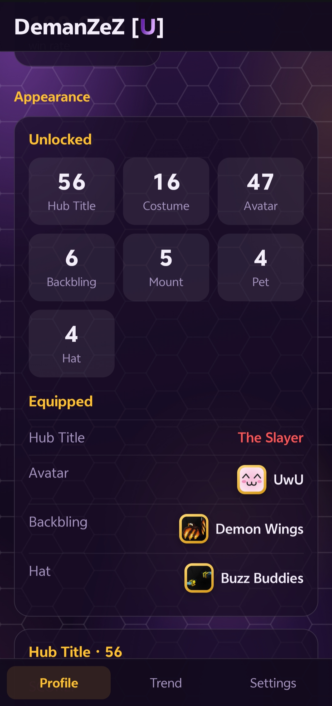
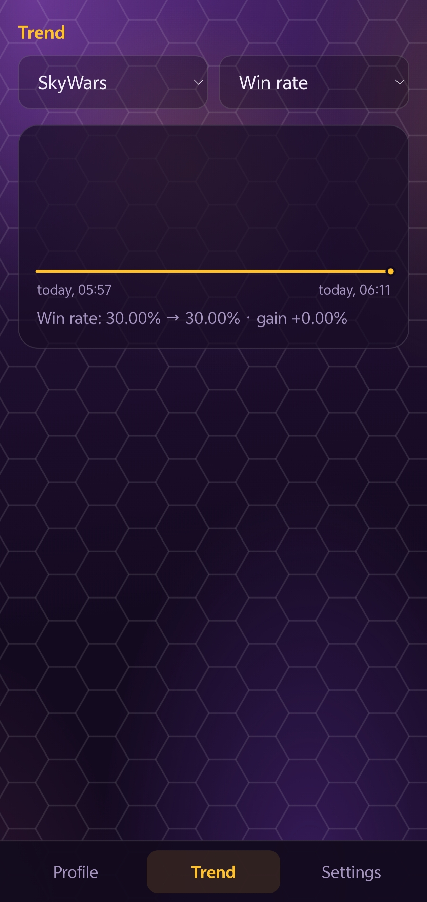
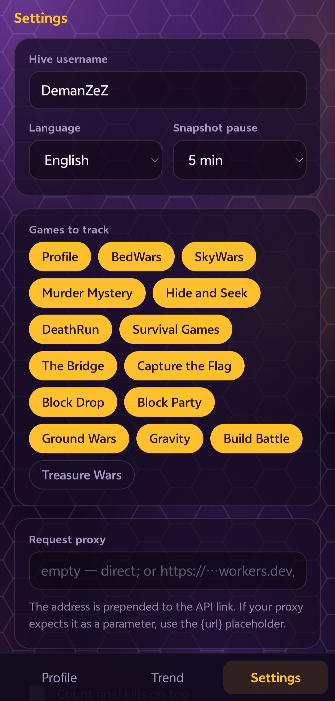
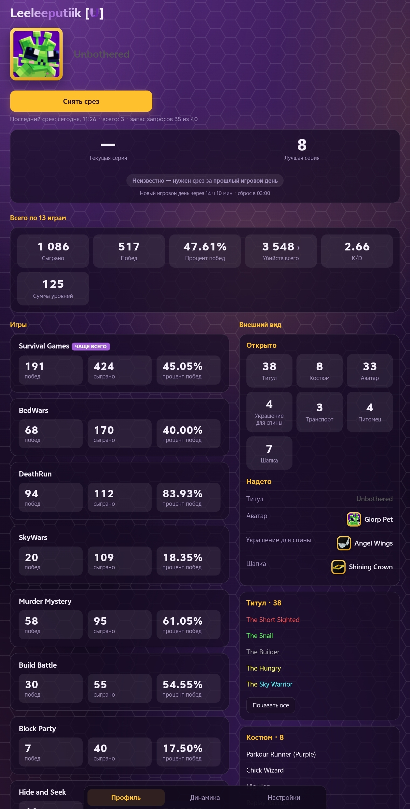

# HiveMC Profile Tracker

Stats tracker for [The Hive](https://playhive.com), the Minecraft Bedrock server. It saves snapshots of your stats over time, so you can see not just where you stand, but how fast you are moving.

**Live:** https://deman-zez.github.io/HiveMC-Profile-Tracker/

> [!NOTE]
> The project is in open beta. Found a bug or have an idea? [Open an issue](https://github.com/deman-zez/HiveMC-Profile-Tracker/issues).

## Screenshots

| Profile | Game breakdown | Cosmetics |
|---|---|---|
|  |  |  |

| Appearance | Trend | Settings |
|---|---|---|
|  |  |  |

## What it does

- **Profile** — rank, avatar, hub title in its real in-game colours, login streak and totals across all games.
- **Every game in detail** — win rate, K/D, per-game averages, level progress with an estimate of how many games the next level takes, and the rewards waiting at that level.
- **Trend** — snapshots turn into charts for any stat, including win rate and K/D, plus a summary of what changed today.
- **Leaderboards** — all-time, monthly and BedWars seasons for every mode, with search by username or place.
- **Compare** — put any two players side by side.
- **Share card** — a ready-made image of your profile for Discord or chats, with a link back to your page.
- **Any player** — search by username, open anyone's profile, or share a link like `?nick=DemanZeZ`.
- **English and Russian**, chosen from your device language.

On screens 900px and wider the page switches to a two-column desktop layout: games on the left, cosmetics on the right.



## Getting started

1. Open the site and go to **Settings**.
2. Type your Hive username and pick it from the suggestions.
3. Go back to **Profile** and press **Take snapshot**.

The first snapshot shows your current stats. From the second one on, the **Trend** tab starts drawing your progress, so come back after a few games.

## Your data

Snapshots are stored in your browser; there is no account to create. To use the tracker on several devices, enter the same sync code in **Settings** on each of them — your snapshots are then kept on the project's server under that code, so treat it like a password. You can also export and import a backup file instead.

## Running locally

Keep the folder structure as it is and serve it over HTTP. Opening `index.html` straight from disk often blocks browser storage, so snapshots would not be saved.

```bash
python3 -m http.server 8080
```

Then open `http://localhost:8080`.

## Credits

- [The Hive](https://playhive.com) for the server and the public API.
- [CubeEdge Studios](https://github.com/CubeEdge-Studios/hive-bedrock) for their open Hive libraries and game data.

This is a fan project, not affiliated with or endorsed by The Hive. Game names, cosmetics and images belong to their owners.

## License

MIT — see [LICENSE](LICENSE).
